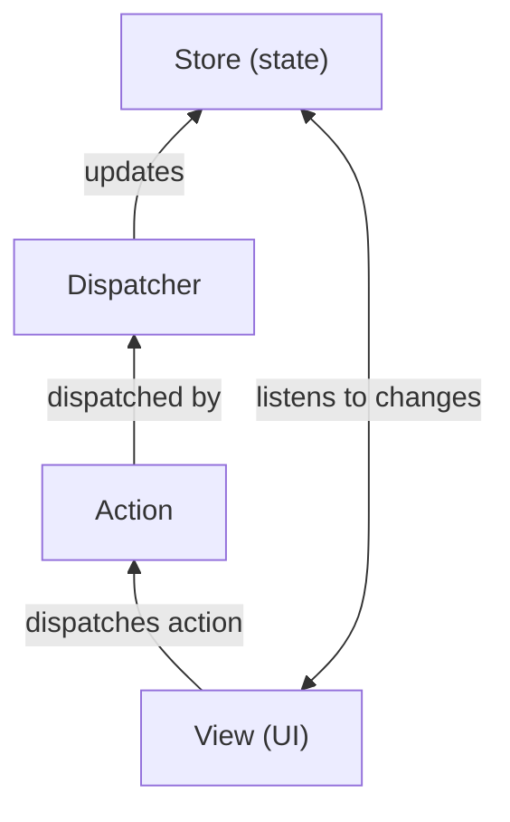

**Flux** is an **application architecture** developed by **Facebook** for building **client-side web applications**. It is primarily designed for managing the **state** of an application in a **predictable and unidirectional** flow, especially for **React** applications. Flux helps handle complex data flow and ensures that the user interface (UI) is consistently in sync with the underlying state.

Flux is not a library or a framework but rather an architectural pattern that provides a structured way to manage data flow in your app.

### Key Principles of Flux Architecture:

Flux introduces a **unidirectional data flow** pattern, which ensures that data always moves in one direction through the system. This makes state changes more predictable and easier to manage.

The core components of Flux are:

1. **Actions**:
    
    - Actions are simple **JavaScript objects** that contain a **type** and **payload**. The **type** defines what kind of action is happening, and the **payload** holds the data necessary to perform the action.
        
    - Actions are sent to a central dispatcher, and they represent user interactions, server responses, or any other event that triggers a change in the application state.
        
    
    **Example of an Action:**
    
    ```javascript
    const ADD_ITEM = 'ADD_ITEM';
    
    function addItem(item) {
      return {
        type: ADD_ITEM,
        payload: item,
      };
    }
    ```
    
2. **Dispatcher**:
    
    - The dispatcher is a **central hub** that manages the flow of data in Flux. It receives actions and broadcasts them to all registered **stores**. The dispatcher ensures that actions are handled in a controlled and organized manner, enforcing a **one-way data flow**.
        
    - The dispatcher doesn’t change the state directly; it simply routes the actions to the appropriate stores.
        
    
    **Example of using the dispatcher:**
    
    ```javascript
    dispatcher.dispatch(addItem('New Item'));
    ```
    
3. **Stores**:
    
    - Stores are **containers** for the application’s state and business logic. They respond to actions and **update the state** based on the type of action received. After the state is updated, stores emit a **change event** to notify the views (components) that the state has changed, triggering a re-render.
        
    - Unlike traditional models in MVC (Model-View-Controller), stores do not just hold data; they also contain the logic to manage how data changes in response to actions.
        
    
    **Example of a Store:**
    
    ```javascript
    const itemStore = {
      items: [],
      addItem(item) {
        this.items.push(item);
        this.emitChange();
      },
      getItems() {
        return this.items;
      },
    };
    ```
    
4. **Views (React Components)**:
    
    - Views are **React components** (or UI components in other frameworks) that listen for changes in the stores. When a store updates, the view re-renders to reflect the new state.
        
    - Views dispatch actions based on user interactions (e.g., clicking a button) to trigger changes in the application state.
        
    
    **Example of a React Component (View):**
    
    ```javascript
    class ItemList extends React.Component {
      componentDidMount() {
        itemStore.addListener(this.updateItems);
      }
    
      updateItems = () => {
        this.setState({ items: itemStore.getItems() });
      };
    
      render() {
        return (
          <ul>
            {this.state.items.map(item => <li key={item}>{item}</li>)}
          </ul>
        );
      }
    }
    ```
    

### The Unidirectional Data Flow in Flux:

Flux enforces **unidirectional data flow**, meaning that data flows in a single direction through the following steps:

1. **View (UI) Interaction**:
    
    - A user interacts with the UI (e.g., clicking a button).
        
2. **Action Creation**:
    
    - The interaction triggers an **action** (a JavaScript object describing the type of change that should occur).
        
3. **Dispatcher**:
    
    - The action is sent to the **dispatcher**, which routes it to all stores that are registered to handle the action.
        
4. **Stores Update**:
    
    - The **stores** receive the action, update their state accordingly, and emit a change event.
        
5. **View Update**:
    
    - The **views** (React components) listen for changes from the stores and re-render to reflect the updated state.
        

### Visualizing Flux Flow:


### Flux vs. Other Architectures (MVC):

In traditional **MVC** (Model-View-Controller) architecture, the **view** often updates the **model**, and then the **view** is updated with the new model state. This can create complex interdependencies and can make state management difficult, especially as the application grows.

**Flux** simplifies this by making the data flow unidirectional:

- **Actions** are dispatched to the **dispatcher**.
    
- **Stores** receive these actions and update the state.
    
- **Views** (React components) listen to state changes from stores and re-render the UI.
    

This unidirectional flow makes **state changes more predictable** and easier to track, leading to easier debugging and maintenance.

### Flux vs. Redux:

**Redux** is a popular **state management library** that was inspired by the **Flux architecture**. While Redux follows the same principles as Flux (unidirectional data flow), it simplifies some of Flux’s concepts:

- **Stores** in Flux are replaced with a **single global store** in Redux, whereas Flux can have multiple stores.
    
- **Reducers** in Redux replace the need for handling actions and updates inside stores.
    
- Redux also has a more **simplified API** for dispatching actions and subscribing to changes.
    

### Benefits of Flux Architecture:

1. **Predictable State**:
    
    - Since actions are dispatched to a central dispatcher and handled by stores, the state updates are predictable, and the flow of data is **easy to track**.
        
2. **Simpler Debugging**:
    
    - The one-way flow of data means that there are fewer places where the state can change unexpectedly, which makes debugging and testing easier.
        
3. **Separation of Concerns**:
    
    - Flux enforces a clear **separation of concerns** between **views**, **actions**, and **stores**. The UI is only concerned with displaying the data, while stores manage state and business logic.
        
4. **Better State Management**:
    
    - By managing the state in stores and using a centralized dispatcher, Flux avoids the pitfalls of complex data binding or shared mutable state, leading to more maintainable and scalable applications.
        
5. **Flexibility**:
    
    - Flux gives you **flexibility** in how actions are managed and how stores communicate, while still maintaining a **clean separation of logic**.
        

### When to Use Flux:

- Flux is beneficial for **large-scale applications** where state management can become complex, especially when there are multiple components that need access to the same state.
    
- If your app’s UI requires frequent updates or changes (e.g., real-time data, user interactions), Flux can help manage this in a more structured and predictable way.
    
- Flux is also useful for applications that require **long-term maintainability** and **scalability**.
    

---

### Conclusion:

**Flux** is an architectural pattern that helps manage state and data flow in React applications. By enforcing **unidirectional data flow**, Flux ensures that state changes are predictable, easier to debug, and more maintainable. The core concepts of Flux—**actions**, **dispatcher**, **stores**, and **views**—help organize and separate concerns in a React application. While **Redux** is a popular library that simplifies and builds upon Flux, the **Flux architecture** provides an important foundation for understanding state management in modern web applications.